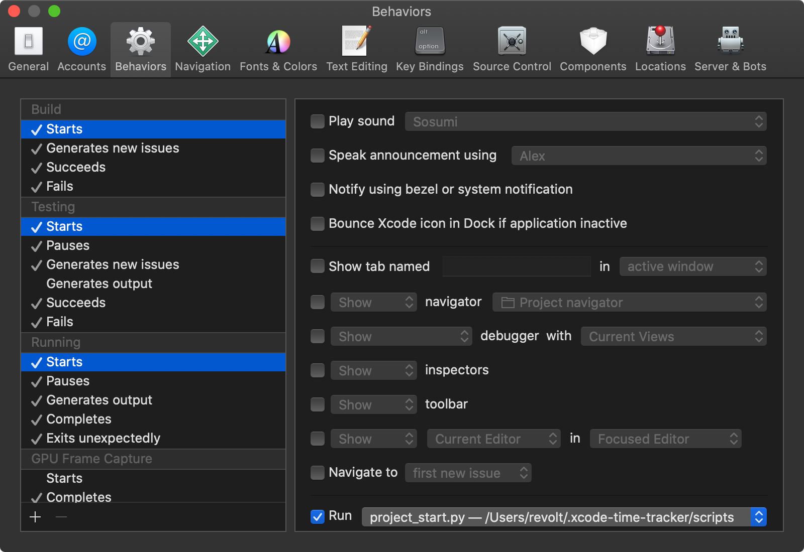
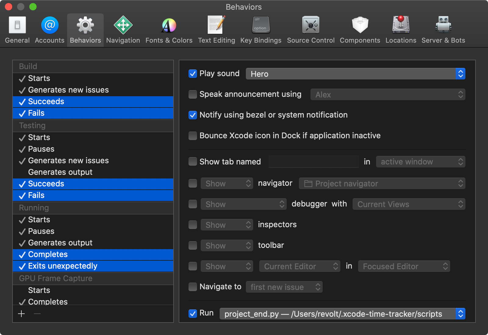

# Xcode Time Tracker

This is a tool that allows you to track the time of events that are happening in
Xcode.  
This tool simply runs tracking scripts based on Xcode behaviors.  
It's independent of the Xcode version (as long as you're using Xcode version 4
or greater).  
It will survive Xcode reinstallations, so it works on _"install and forget
basis"_.

# Raw output example

The result of this tool will be one simple CSV file looking like this:

```csv
No project,TimeTracker.xcworkspace,1497876725,1497876729,Build Succeeded,4
No project,TimeTracker.xcworkspace,1497876729,1497877067,Run Completed,338
TimeTracker.xcodeproj,No workspace,1497877067,1497877088,Build Succeeded,21
```

Where the columns are: `Project name`, `Workspace name`, `Time start`,
`Time end`, `Event name` and `Time spent`.

# Installation

There are two installation steps:
1. Download the project by running this command in terminal:

```sh
git clone https://github.com/revolter/xcode-time-tracker ~/.timecheck
```

2. Set up Xcode behaviors to run the scripts on every run.

## Xcode behaviors setup

1. Select the `Xcode` > `Behaviors` > `Edit Behaviors...` menu.


2. Set the `~/.timecheck/scripts/project_start.py` script as the `Run` phase of
   these start behaviors:



3. Set the `~/.timecheck/scripts/project_end.py` script as the `Run` phrase of
   these end behaviors:



## Check the installation

Build your project and see if the `results.csv` file appeared in the
`~/.timecheck` directory.  
It should contain lines looking like [these](#raw-output-example).

# Update

To update the scripts, run these commands in terminal:

```sh
cd ~/..timecheck
git pull
```

# Visualization

The next step is to visualize this information.  
I used the [R](https://www.r-project.org/about.html) language for that, but
there's more coming.  
This how it can look like if you'll be able to set up R correctly:


# Reporting

You can also get a report for this information.  
I used the [Ruby](https://www.ruby-lang.org/en/about/) language for that.  
There are two ways for using this:
1. You can run it directly by using this command in terminal:

```sh
~/.timecheck/bin/xcode-time-tracker-report
```

2. You can change the `PATH` environment variable by adding:

```sh
export PATH="$HOME/.timecheck/bin:$PATH"
```

to your shell configuration file (`.bash_profile`, `.zshrc`, etc.), and then run
the command

```sh
xcode-time-tracker-report
```

in terminal.

It will print a JSON report containing the **total**, **average** and
**maximum** times spent building **today**, **this week** and **all time**,
separated by projects and workspaces, which looks like this:

```json
{
    "projects": [
        {
            "name": "TimeTracker.xcodeproj",
            "today": {
                "total": "00:00:12",
                "average": "00:00:06",
                "maximum": "00:00:08"
            },
            "this week": {
                "total": "00:02:34",
                "average": "00:00:07",
                "maximum": "00:00:09"
            },
            "all time": {
                "total": "00:06:55",
                "average": "00:00:09",
                "maximum": "00:00:12"
            }
        }
    ],
    "workspaces": [
        {
            "name": "TimeTracker.xcworkspace",
            "today": {
                "total": "00:34:15",
                "average": "00:01:02",
                "maximum": "00:07:49"
            },
            "this week": {
                "total": "04:57:35",
                "average": "00:01:20",
                "maximum": "00:09:38"
            },
            "all time": {
                "total": "1 day 16:38:16",
                "average": "00:01:09",
                "maximum": "00:14:42"
            }
        }
    ]
}
```
